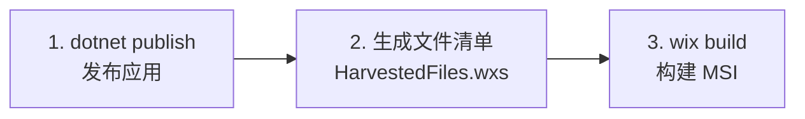

# GameSave Manager - MSI 安装包构建指南

> 本文档说明如何使用 WiX Toolset v6 构建 MSI 安装包。

---

## 目录

- [前置要求](#前置要求)
- [快速构建](#快速构建)
- [构建参数说明](#构建参数说明)
- [安装包特性](#安装包特性)
- [项目结构](#项目结构)
- [工作原理](#工作原理)
- [常见问题](#常见问题)

---

## 前置要求

### 1. .NET SDK

确保已安装 .NET 10 SDK（或项目所需版本）：

```bash
dotnet --version
```

### 2. WiX Toolset CLI

安装 WiX Toolset 全局工具：

```bash
dotnet tool install --global wix
```

### 3. WiX UI 扩展

安装 WiX UI 扩展（用于安装向导界面）：

```bash
wix extension add WixToolset.UI.wixext/6.0.2
```

---

## 快速构建

### 默认构建（x64 平台）

```powershell
.\build-msi.ps1
```

### 指定平台和版本

```powershell
# x64 平台
.\build-msi.ps1 -Platform x64 -Version 1.2.0

# x86 平台
.\build-msi.ps1 -Platform x86 -Version 1.2.0

# ARM64 平台
.\build-msi.ps1 -Platform ARM64 -Version 1.2.0
```

### 跳过发布步骤（使用已有的发布文件）

```powershell
.\build-msi.ps1 -Platform x64 -SkipPublish
```

### 输出位置

构建完成后，MSI 文件位于：

```
installer-output/GameSave-{Platform}-Setup.msi
```

例如：`installer-output/GameSave-x64-Setup.msi`

---

## 构建参数说明

| 参数 | 类型 | 默认值 | 说明 |
|------|------|--------|------|
| `-Platform` | string | `x64` | 目标平台，支持 `x64`、`x86`、`ARM64` |
| `-Version` | string | `1.0.0` | 安装包及软件内显示的版本号，格式 `Major.Minor.Build`。会同时写入 MSI 安装包和程序集信息，软件设置页面的"关于"区域会自动显示此版本号 |
| `-SkipPublish` | switch | 否 | 跳过 `dotnet publish` 步骤 |

---

## 安装包特性

### 安装行为

- **安装模式**：per-user（不需要管理员权限）
- **安装目录**：`%LOCALAPPDATA%\GameSave\GameSave Manager\`
- **快捷方式**：自动创建桌面快捷方式和开始菜单快捷方式
- **升级策略**：安装新版本时自动卸载旧版本
- **卸载**：可通过"设置 > 应用 > 已安装的应用"正常卸载

### 安装向导

安装包提供标准的 Windows Installer 向导界面（WixUI_InstallDir），包含：

1. 欢迎页面
2. 安装目录选择
3. 安装确认
4. 安装进度
5. 完成页面

---

## 项目结构

```
gamesave/
├── build-msi.ps1                        # MSI 构建脚本（入口）
├── src/
│   ├── GameSave/                        # 主应用项目
│   └── GameSave.Installer/             # WiX 安装包项目
│       ├── GameSave.Installer.wixproj  # WiX 项目文件（备用）
│       ├── Package.wxs                 # 安装包主定义文件
│       └── HarvestedFiles.wxs          # 自动生成的文件清单（勿手动编辑）
└── installer-output/                    # MSI 输出目录
```

---

## 工作原理

构建脚本 `build-msi.ps1` 执行以下三个步骤：



### 步骤详解

1. **发布应用**：使用 `dotnet publish` 以 Release + SelfContained + Trimmed 模式发布
2. **生成文件清单**：PowerShell 脚本扫描发布目录，动态生成 `HarvestedFiles.wxs`（包含所有文件和目录的 WiX 组件定义）
3. **构建 MSI**：使用 `wix build` CLI 将 `Package.wxs`（安装包定义）和 `HarvestedFiles.wxs`（文件清单）编译链接为 MSI 安装包

---

## 常见问题

### Q: 构建报错 "extension could not be found"

请先安装 WiX UI 扩展：

```bash
wix extension add WixToolset.UI.wixext/6.0.2
```

### Q: 如何修改安装目录

编辑 `src/GameSave.Installer/Package.wxs`，修改 `INSTALLFOLDER` 相关的 `Directory` 定义：

```xml
<StandardDirectory Id="LocalAppDataFolder">
    <Directory Id="CompanyDir" Name="GameSave">
        <Directory Id="INSTALLFOLDER" Name="GameSave Manager" />
    </Directory>
</StandardDirectory>
```

### Q: 如何修改安装包图标

替换 `src/GameSave/Assets/app.ico` 文件即可。

### Q: 构建出的 MSI 很小（< 1MB）

这通常表示文件未被正确收集。请确保先运行 `dotnet publish` 生成发布文件，或去掉 `-SkipPublish` 参数。

### Q: 安装后应用无法启动

确保系统安装了 Windows App SDK 运行时，或使用 SelfContained 模式发布（默认已启用）。
