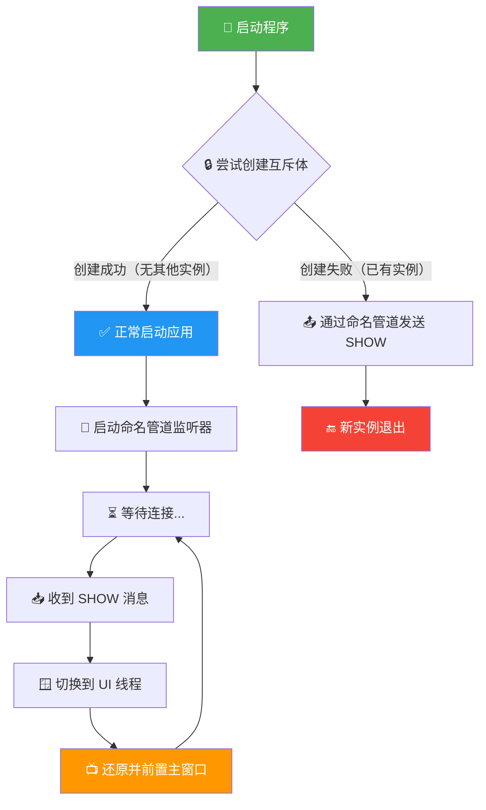

# 单实例运行

> 防止应用程序多开，确保同一时间只有一个实例运行。再次启动时自动将已有窗口前置显示。

---

## 功能说明

GameSave Manager 实现了单实例运行机制，确保同一时间只能运行一个应用实例：

- **首次启动**：正常启动应用，同时创建全局互斥体和命名管道监听器
- **再次启动**：检测到已有实例运行，通过命名管道发送 "显示窗口" 消息，然后自动退出
- **已有实例响应**：收到消息后，自动将主窗口还原并前置显示（即使窗口已最小化到系统托盘）

## 技术实现

### 核心组件

| 组件 | 文件 | 说明 |
|------|------|------|
| 自定义入口点 | `Program.cs` | 使用全局命名互斥体 (`Mutex`) 检测是否已有实例 |
| 管道监听器 | `App.xaml.cs` | 后台线程监听命名管道，收到消息后在 UI 线程显示窗口 |
| 管道客户端 | `Program.cs` | 第二个实例通过命名管道发送通知后退出 |

### 工作流程

### 项目配置

在 `GameSave.csproj` 中定义了 `DISABLE_XAML_GENERATED_MAIN` 常量，禁用 WinUI 3 自动生成的 `Main` 方法，改用 `Program.cs` 中的自定义入口点。

## 注意事项

1. **调试模式和发布模式均生效**：单实例检测在两种模式下都有效
2. **托盘隐藏场景**：即使主窗口已最小化到系统托盘，再次运行也能正确还原窗口
3. **管道超时**：第二个实例连接管道的超时时间为 3 秒，超时后静默退出
4. **资源清理**：应用退出时会正确取消命名管道监听器，释放系统资源
