# GameSave Manager - 开发文档

> 本文档描述 GameSave Manager 的核心业务逻辑、页面功能、数据模型以及关键流程。

---

## 目录

- [1. 系统架构概览](#1-系统架构概览)
- [2. 数据模型](#2-数据模型)
- [3. 页面功能说明](#3-页面功能说明)
  - [3.1 主页 - 游戏列表](#31-主页---游戏列表)
  - [3.2 设置页面](#32-设置页面)
  - [3.3 本地存档页面](#33-本地存档页面)
  - [3.4 云端存档页面](#34-云端存档页面)
- [4. 核心业务流程](#4-核心业务流程)
  - [4.1 添加游戏](#41-添加游戏)
  - [4.2 启动游戏（全流程备份）](#42-启动游戏全流程备份)
  - [4.3 恢复存档](#43-恢复存档)
  - [4.4 手动备份](#44-手动备份)
  - [4.5 云端同步](#45-云端同步)
- [5. 存档标签体系](#5-存档标签体系)
- [6. 工作目录与文件结构](#6-工作目录与文件结构)
- [7. 服务层架构](#7-服务层架构)

---

## 1. 系统架构概览

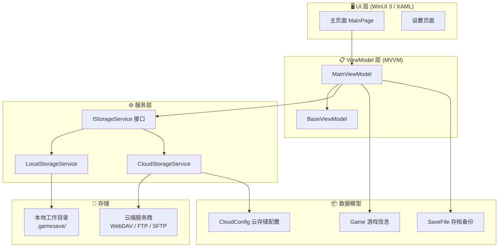

---

## 2. 数据模型

### Game（游戏信息）

| 字段 | 类型 | 说明 |
|------|------|------|
| `Id` | `string` | 游戏唯一标识（GUID），用于存档目录命名 |
| `Name` | `string` | 游戏名称 |
| `SaveFolderPath` | `string` | 游戏存档目录路径 |
| `IconPath` | `string?` | 游戏图标路径（可选） |
| `AddedAt` | `DateTime` | 添加时间 |
| `Notes` | `string?` | 备注信息 |

### SaveFile（存档备份）

| 字段 | 类型 | 说明 |
|------|------|------|
| `Id` | `string` | 存档唯一标识（GUID） |
| `GameId` | `string` | 所属游戏 ID |
| `Name` | `string` | 存档名称（备份点名） |
| `Path` | `string` | 存档文件路径 |
| `BackupTime` | `DateTime` | 备份时间 |
| `SizeBytes` | `long` | 文件大小（字节） |
| `StorageType` | `StorageType` | 存储类型：`Local` / `Cloud` |
| `Description` | `string?` | 描述 / 备注 |

### CloudConfig（云存储配置）

| 字段 | 类型 | 说明 |
|------|------|------|
| `Id` | `string` | 配置唯一标识（GUID） |
| `DisplayName` | `string` | 显示名称（如"我的坚果云"） |
| `ProviderType` | `CloudProviderType` | 云存储类型：`WebDav` / `Ftp` / `Sftp` / `LocalFolder` |
| `ServerUrl` | `string?` | 服务器地址 |
| `Username` | `string?` | 用户名 |
| `Password` | `string?` | 密码（加密存储） |
| `RemoteBasePath` | `string` | 远端存储根路径，默认 `/GameSave` |
| `IsEnabled` | `bool` | 是否启用 |

### 模型关系图

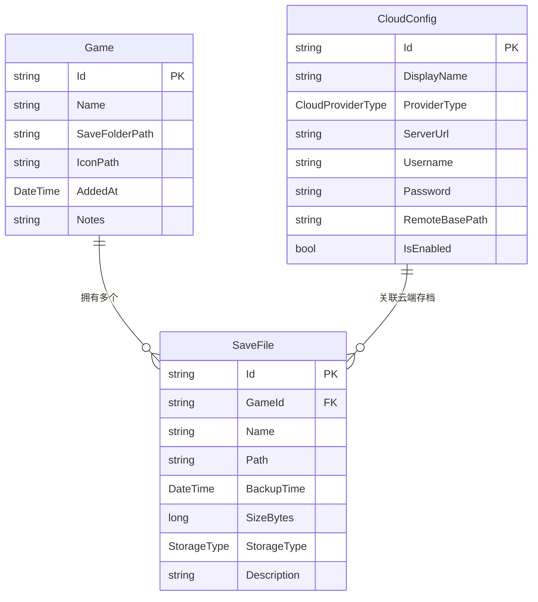

---

## 3. 页面功能说明

### 3.1 主页 - 游戏列表

主页面展示用户已添加的所有游戏卡片，选中游戏后可查看该游戏的存档列表。

**核心功能：**
- 显示游戏卡片列表（名称、图标、添加日期）
- 点击游戏卡片展开存档详情面板
- 支持添加新游戏（弹窗表单）
- 支持手动备份、恢复存档、删除存档
- 支持在存档详情面板中快速打开备份存档目录（使用文件管理器）

**添加游戏表单字段：**

| 序号 | 字段 | 必填 | 说明 |
|------|------|------|------|
| 1 | 游戏名称 | ✅ | 用户自定义的游戏显示名称 |
| 2 | 游戏存档目录 | ✅ | 游戏存档文件所在的目录路径 |
| 3 | 游戏启动进程 | ❌ | 可选，用于自动检测游戏运行状态 |
| 3.1 | └ 启动附加参数 | ❌ | 可选，启动进程时的附加命令行参数 |
| 4 | 云端服务商 | ❌ | 可选，选择已配置的云端服务商 |

### 3.2 设置页面

#### 工作目录

所有游戏存档和文件处理的操作均在此目录下进行。

- **默认路径**：`C:\Users\<用户名>\xingchen\ycyaw\.gamesave`
- 用户可自定义修改工作目录位置

#### 工作目录结构

```
.gamesave/
├── <游戏ID-1>/                    # 以游戏唯一标识命名
│   ├── 1709234567_退出存档.tar    # 退出时自动备份
│   ├── 1709234890_手动存档.tar    # 用户手动备份
│   └── 1709235123_手动存档.tar    # 可以有多个手动存档
├── <游戏ID-2>/
│   └── ...
└── config.json                    # 全局配置文件
```

> 所有存档均为 `.tar` 归档文件，文件名格式为：`时间戳_存档标签.tar`

### 3.3 本地存档页面

展示选中游戏的所有本地存档列表，支持查看、恢复、删除等操作。

### 3.4 云端存档页面

云端存档用于备份本地存档到远程存储。

**核心逻辑：**
1. 用户需先配置云端服务商（设置页面）
2. 自动检测云端已有的所有游戏存档
3. 支持按游戏维度导入云端存档到本地
4. 本地每次备份完毕后，自动上传到云端

> 当前优先实现阿里云 OSS，但架构设计需支持扩展更多服务商。

---

## 4. 核心业务流程

### 4.1 添加游戏

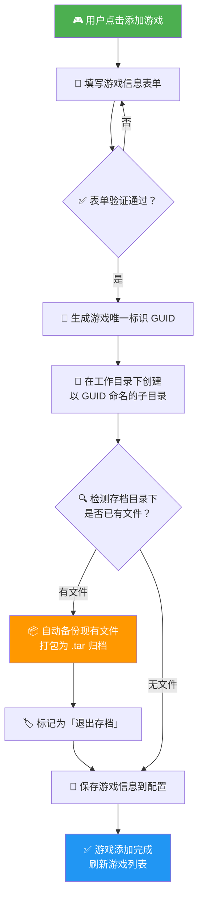

### 4.2 启动游戏（全流程备份）

这是最核心的流程，覆盖了从启动游戏到进程退出的完整存档保护生命周期。

支持 Steam 游戏的 stub 进程检测：当启动的 exe 在 5 秒内退出时，自动切换到进程名轮询模式。

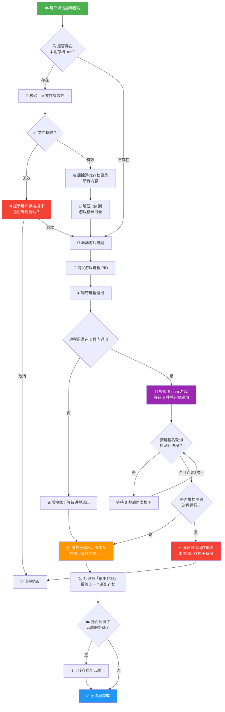

> **备份模式说明：** 游戏退出后的自动备份使用「直接模式」，即直接从存档目录打包 .tar，无需先复制到临时快照目录。这是因为游戏已确认退出，不存在文件锁定冲突的风险，可以节省内存和磁盘 I/O。

#### 启动流程进度显示

启动游戏流程中，各步骤的进度会在**游戏列表项的启动按钮左侧**实时展示（带旋转进度圈），不占用底部状态栏空间，避免与存档备份等通知冲突：

| 进度 | 步骤 | 列表项消息示例 |
|------|------|----------------|
| 0%  | 开始启动流程 | "正在检查本地存档..." |
| 20% | 存档检查完成 | "发现退出存档，正在校验..." 或 "无本地存档，准备启动..." |
| 40% | 存档校验完成 | "存档校验通过，正在恢复..." 或 "存档校验失败" |
| 50% | 清空存档目录 | "正在清空存档目录..." |
| 60% | 解压存档 | "正在解压存档..." |
| 80% | 存档恢复完成 | "存档恢复完成，正在启动游戏..." |
| 90% | 启动游戏进程 | "正在启动游戏..." |
| —   | 启动完成（切换为 `Running` 状态） | 启动状态消息清空，列表项显示停止按钮 |
| —   | 异常退出检测 | 底部状态栏显示 "检测到 游戏名 异常退出，本次不备份" |

> 侧边栏状态指示仍然保持同步更新。
> 若用户在存档损坏提示中选择「取消」，启动状态消息清空。
> 若检测到 Steam stub 进程快速退出且真实游戏进程从未启动，会弹窗提示程序崩溃并跳过备份。

#### 启动游戏时序图

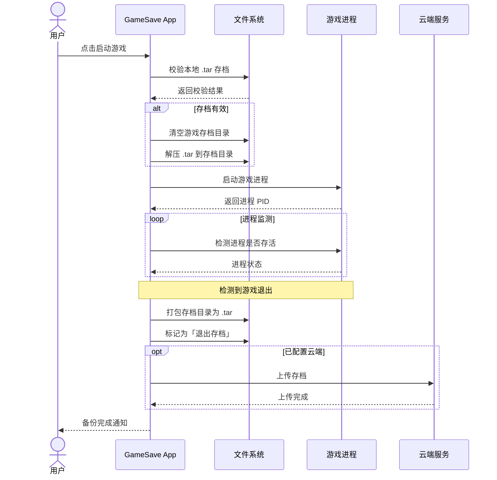

### 4.3 恢复存档

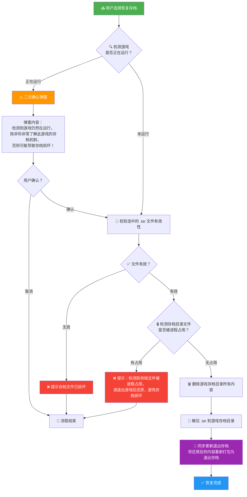

> **重要说明：** 仅支持恢复「手动存档」，「退出存档」不支持用户手动恢复操作。
> 
> **退出存档同步：** 恢复存档成功后，系统会自动将还原后的存档目录内容重新创建为退出存档。这确保了下次通过应用启动游戏时，恢复的是用户还原后的版本，而非旧的退出存档。
> 
> **文件占用检测：** 恢复存档前会检测目标存档目录下的文件是否被其他进程（如游戏进程）占用。如果检测到占用，将拒绝恢复并提示用户先退出游戏。

### 4.4 手动备份

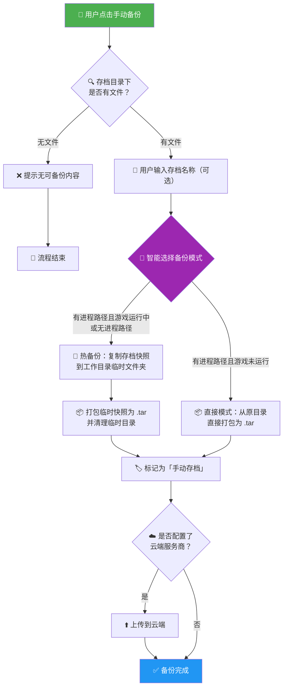

> **备份模式智能选择规则：**
> - **热备份**（先复制到临时目录再打包）：游戏正在运行中，或未设置启动进程路径（无法判断游戏是否在外部运行）
> - **直接打包**（跳过临时复制）：设置了启动进程路径且检测到游戏未运行，节省约一半的内存和磁盘 I/O 消耗

### 4.5 云端同步

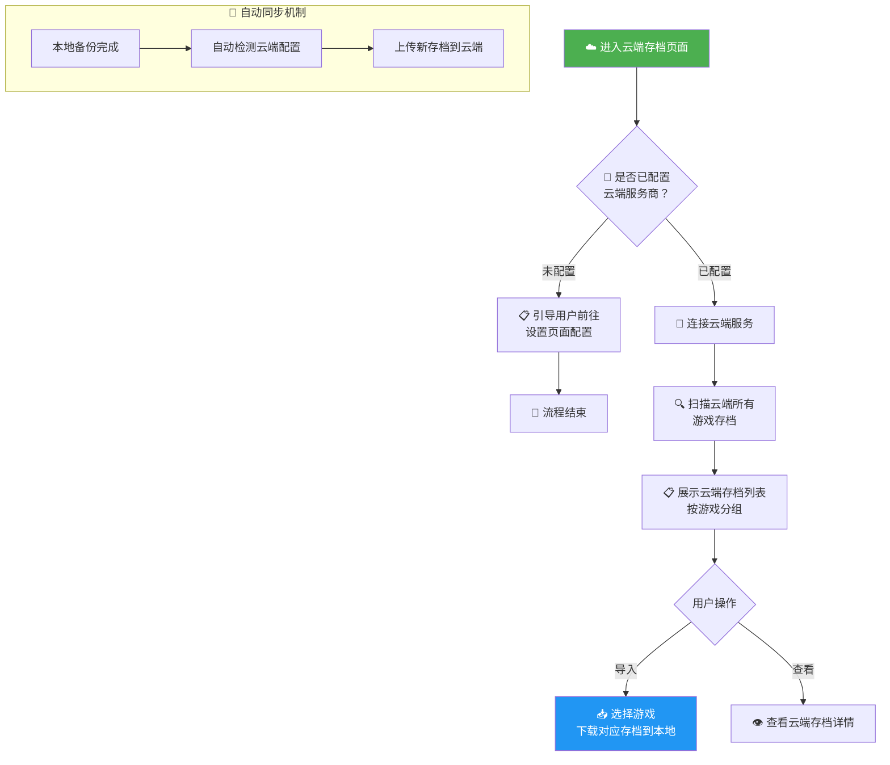

---

## 5. 存档标签体系

系统使用两种存档标签来区分不同类型的备份：

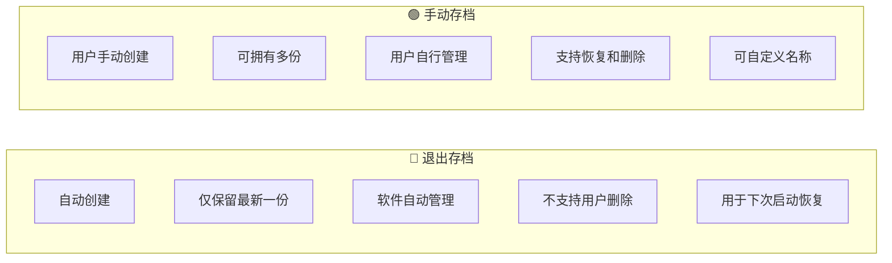

| 对比项 | 退出存档 | 手动存档 |
|--------|----------|----------|
| **创建方式** | 游戏退出后自动备份 | 用户手动点击备份 |
| **数量限制** | 仅保留 1 份（最新） | 无限制，可有多份 |
| **管理者** | 软件自动管理 | 用户自行管理 |
| **可删除** | ❌ 不支持 | ✅ 支持 |
| **可恢复** | ❌ 不支持手动恢复 | ✅ 支持 |
| **用途** | 确保下次启动时存档可用 | 用户自主保存的关键进度节点 |

---

## 6. 工作目录与文件结构

### 默认路径

```
C:\Users\<用户名>\xingchen\ycyaw\.gamesave
```

### 完整目录结构示意

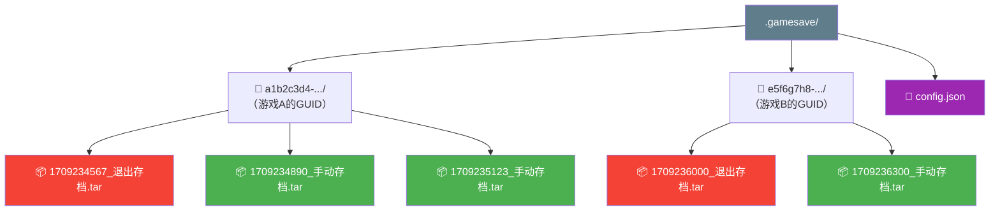

**文件命名规则：**
- 格式：`{Unix时间戳}_{存档标签}.tar`
- 退出存档示例：`1709234567_退出存档.tar`
- 手动存档示例：`1709234890_手动存档.tar`

---

## 7. 服务层架构

### 接口设计

所有存储操作通过 `IStorageService` 统一接口实现，便于扩展不同的存储后端。

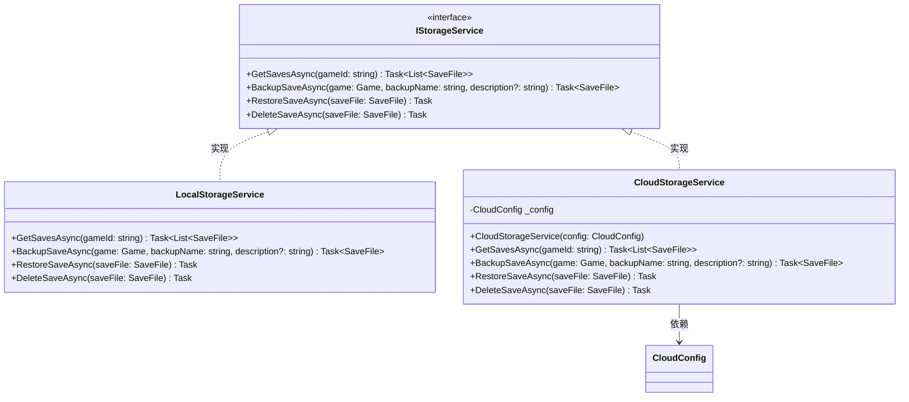

### 云存储扩展

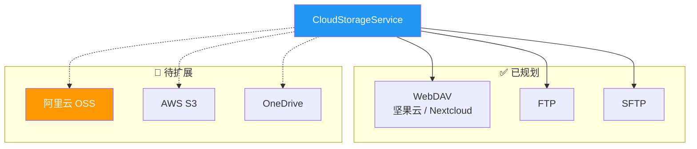